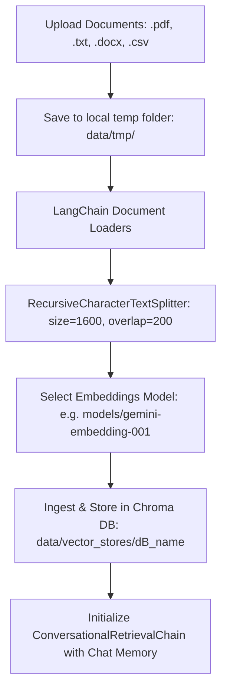
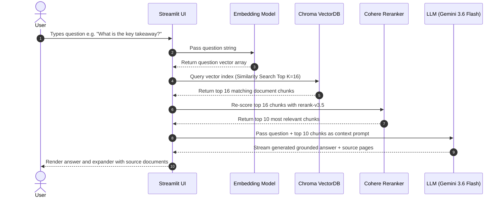

# RAG chatbot powered by 🔗 Langchain, OpenAI, Google Generative AI and Hugging Face 🤗

<div align="center">
  
  <figcaption>RAG architecture with Langchain components.</figcaption>
</div>

## Project Overview <a name="overview"></a>

Although Large Language Models (LLMs) are powerful and capable of generating creative content, they can produce outdated or incorrect information as they are trained on static data. To overcome this limitation, Retrieval Augmented Generation (RAG) systems can be used to connect the LLM to external data and obtain more reliable answers.

The aim of this project is to build a RAG chatbot in Langchain powered by [OpenAI](https://platform.openai.com/overview), [Google Generative AI](https://ai.google.dev/?hl=en) and [Hugging Face](https://huggingface.co/) **APIs**. You can upload documents in txt, pdf, CSV, or docx formats and chat with your data. Relevant documents will be retrieved and sent to the LLM along with your follow-up questions for accurate answers.

Throughout this project, we examined each component of the RAG system from document loader to conversational retrieval chain. Additionally, we developed a user interface using [streamlit](https://streamlit.io/) application.

## Installation <a name="installation"></a>

This project requires Python 3 and the following Python libraries installed:

`langchain` ,`langchain-openai`, `langchain-google-genai`, `chromadb`, `streamlit`, `streamlit`

The full list of requirements can be found in `requirements.txt`

## Instructions <a name="instructions"></a>

To run the app locally:

1. Create a virtual environment: `python -m venv langchain_env`
2. Activate the virtual environment: `.\langchain_env\Scripts\activate` on Windows.
3. Install the required dependencies: `pip install -r requirements.txt`
4. Set up your `.env` file with your API keys (see `.env.example`):
   ```env
   GOOGLE_API_KEY=your_google_api_key
   HUGGINGFACEHUB_API_TOKEN=your_huggingface_token
   COHERE_API_KEY=your_cohere_api_key
   OPENAI_API_KEY=
   ```
5. Start the app: `streamlit run RAG_app.py`
6. Open your browser at `http://localhost:8501`.

---

## Detailed Parameter & System Architecture Guide <a name="parameters"></a>

### 1. LLM Provider & Model Parameters

* **LLM Provider**: Choose between **Google**, **HuggingFace**, or **OpenAI**. Controls which backend engine generates answer responses to user queries.
* **Model Selection**:
  * **Google**: `gemini-3.6-flash`, `gemini-2.5-flash`, `gemini-3.5-flash`
  * **HuggingFace**: `mistralai/Mistral-7B-Instruct-v0.2`
  * **OpenAI**: `gpt-3.5-turbo`, `gpt-4-turbo-preview`
* **Temperature (`0.0` – `1.0`)**: Controls answer randomness and creativity.
  * **Lower values (0.1)**: Deterministic, highly factual, accurate answers based strictly on retrieved documents.
  * **Higher values (0.8+)**: More creative and varied phrasing.
* **Top-p (`0.0` – `1.0`)**: Nucleus sampling probability threshold. Limits candidate tokens to those with top cumulative probabilities for controlled generation.
* **Assistant Language**: Sets default language for the chatbot greeting and user interface messages.

---

### 2. Retriever Parameters

Retrievers search the vector store for context relevant to the user's question before calling the LLM.

* **Retriever Types**:
  1. **Vectorstore backed retriever**: Standard similarity search directly from Chroma DB. Retrieves the top $k$ nearest vector embeddings matching the question.
  2. **Contextual compression**: Applies a Document Compressor Pipeline to filter redundant text, split long contexts, and re-order chunks by relevance score.
  3. **Cohere reranker**: Uses Cohere's state-of-the-art `rerank-v3.5` model to re-score and re-rank document chunks based on deep semantic relevance to maximize context precision before passing chunks to the LLM.
* **Base Retriever Search Type**: Set to `similarity` (vector cosine/Euclidean distance matching).
* **Base Retriever $k$** (*Default: 16*): Initial count of top document chunks retrieved from Chroma DB.
* **Compression Retriever $k$** (*Default: 20*): Number of document chunks returned after contextual compression.
* **Cohere Top $N$** (*Default: 10*): Final top $N$ most relevant chunks selected by Cohere reranker.

---

### 3. How "Create Vectorstore" Works (Ingestion & Embedding Workflow) <a name="create_vectorstore"></a>

When you select your documents in Tab 1 (**"Create a new Vectorstore"**) and click **Create Vectorstore**, the system executes the following multi-step pipeline:



#### Step-by-Step Breakdown:

1. **Document Selection & Temporary Storage**:
   * Files selected via `st.file_uploader` (`.pdf`, `.txt`, `.docx`, `.csv`) are saved to local disk directory `data/tmp/`.

2. **Document Loading**:
   * Appropriate LangChain loaders (`PyPDFLoader`, `TextLoader`, `CSVLoader`, `Docx2txtLoader`) parse raw documents into standard `Document` objects containing content and metadata (source filename, page numbers).

3. **Text Chunking**:
   * `RecursiveCharacterTextSplitter` breaks down long documents into processable chunks:
     * **`chunk_size` = 1600**: Maximum character length per chunk.
     * **`chunk_overlap` = 200**: Overlap between consecutive chunks to preserve contextual continuity across chunk boundaries.

4. **Embedding Generation**:
   * Text chunks are converted into dense numerical vector representations using the active provider's embedding model:
     * **Google**: `models/gemini-embedding-001`
     * **OpenAI**: `text-embedding-3-small` / `OpenAIEmbeddings`
     * **HuggingFace**: `thenlper/gte-large`

5. **Chroma DB Ingestion & Persistence**:
   * Embeddings and chunk metadata are ingested into a local **Chroma DB** vector store folder named after your input (saved at `data/vector_stores/<Vectorstore_name>`).
   * The database is persisted locally so you can reload it anytime under **"Open a saved Vectorstore"** without re-processing files.

6. **Chain & Memory Initialization**:
   * The system constructs a `ConversationalRetrievalChain` combining the vectorstore retriever, chat history (`ConversationBufferMemory`), and response LLM (`gemini-3.6-flash`).
   * You can now ask questions in the chat window, and the chatbot will answer accurately using context retrieved from your documents!

---

## Blog post <a name="blog_post"></a>

I wrote a blog post about this project. You can find it [here](https://medium.com/@alaeddine.grine/rag-chatbot-powered-by-langchain-openai-google-generative-ai-and-hugging-face-apis-6a9b9d7d59db)

---

## How Vectorstore Works (Under the Hood) <a name="vectorstore_explanation"></a>

### 1. High-Dimensional Vector Embeddings
A **Vectorstore** (or Vector Database) converts unstructured text (PDFs, Word docs, CSVs, TXT files) into high-dimensional numerical vectors using an Embedding Model (e.g., `models/gemini-embedding-001`).

* Each text chunk is mapped to a vector array of numbers (e.g., 768 or 3072 dimensions).
* Concepts with similar meanings are positioned close to each other in vector space, allowing the system to understand semantic meaning (e.g., `"revenue"` and `"earnings"` will have high vector similarity even though they are different words).

### 2. Chroma DB Storage Structure
In this application, **Chroma DB** is used as the local persistent vector database. Each vector store folder created under `data/vector_stores/<Vectorstore_name>/` contains:

* **Vector Index**: An optimized HNSW (Hierarchical Navigable Small World) index for lightning-fast Nearest Neighbor search.
* **Document Chunks**: The original text chunks associated with each embedding vector.
* **Metadata Store**: Extra context attributes attached to each chunk, such as `source` (filename) and `page` number.

### 3. Query & Answer Generation Loop




